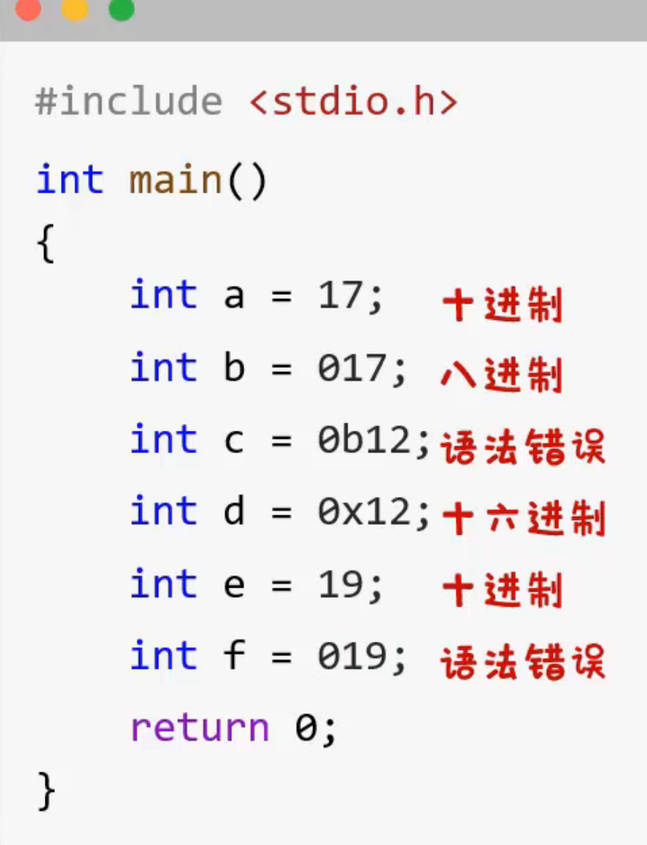
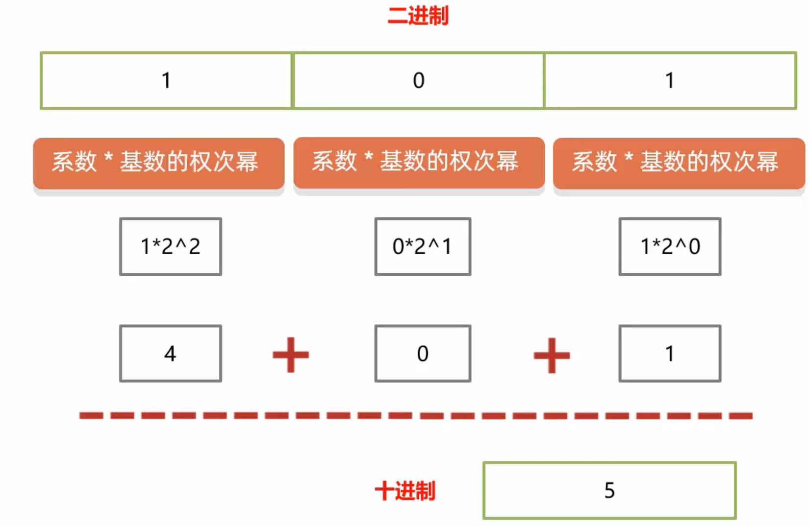
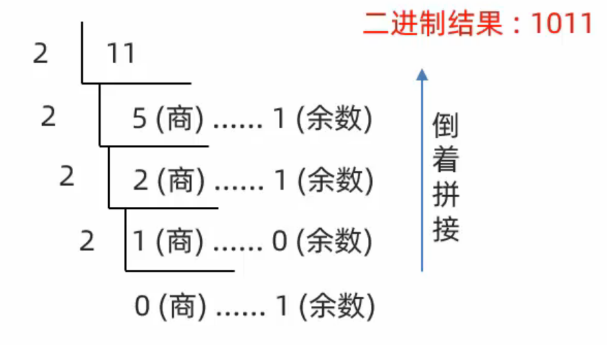

## 1、注释

### 1.1 单行注释

- 语法：// 待注释的内容
- 位置：可放在代码后，称之为行尾注释； 也可放代码上一行，称作行上注释。

```c
// 这是单行注释文字
```

### 1.2 多行注释

- 语法：/* 待注释的内容 */
- 注意：多⾏注释内，可以嵌套单⾏注释。 多⾏注释之间不能嵌套。

```c
/*
这是多行注释文字
这是多行注释文字
这是多行注释文字
*/
注意：多行注释不能嵌套使用。
```

### 1.3 示例

```c
#include <stdio.h> 
/*
这里
是多行
注释
书写的内容
*/
int main(void) {
    printf("HelloWorld\n");	// 这是单行注释，此行为输出 HelloWorld
    
    // 单行注释，可以放在代码行尾，也可以放在行上
	return 0; 
}
```

### 1.4 注释的小扩展

* 注释的快捷键：Ctrl + K，Ctrl + C/U
* 注释擦除：注释的内容，不参与运行
* 注释的嵌套：不管是单行还是多行，最好都不要嵌套

## 2，关键字

关键字：在C语言中被赋予了特定含义的英文单词，一共有32个关键字

但是不需要背，后面会挨个讲解，现在只要只有关键字的两个特点即可：

* 关键字全部小写

* 在特定的编译器中，关键字是高亮显示的

  vs：蓝色或者紫色

  vs：蓝色

```c
auto  break  case  char  const  continue  default  do  double else  enum 
extern float  for  goto  if  int  long  register   return  short  signed
sizeof  static struct  switch  typedef union  unsigned  void  volatile  while
```

现在知道两个关键字即可：

int：表示整数

return：表示程序结束了

## 3, 常量

### 3.1 什么是常量

​	程序运行的过程中，其值永远不会发生改变的数据

### 3.2 常量的分类

 

​       注意：“123+456” 是进行加减乘除计算，属于整型常量；如果不需要计算，只是展示出来，整型常量和字符串常量都可

### 3.3 练习

​	给你一组数据，说出下面每组数据中，分别是哪种类型的常量

```c
0	:整形常量
0.0	:实型常量
-25	:整形常量
123 :整形常量
17.0:实型常量
‘’  :语法错误
‘ ’ :字符常量
‘a’ :字符常量
‘!’ :字符常量
‘#’ :字符常量
‘ab’:语法错误
‘题’:语法错误
‘￥’:语法错误
“”  :字符串常量
“你好”:字符串常量 
```

### 3.4 细节补充

实型常量的小细节：

* 小数点前后，如果只有0，可以省略不写

```c
0.93 可以写成 .93
18.0 可以写成 18.
```

* 科学计数法是实型常量，但是要写E

```c
12340000 可以写成 1.2340000E7
但是写成 1.234 * 10的7次方就错误了，因为这是一个计算过程，不是最终的数字
```

### 3.5 练习

1. 选择题：

```c
1. 以下选项中正确的整型常量是：B
A） 12.		B) -20		C)  1,000		   D) 4 5 6
```

2. 选择题：

```c
2.以下选项中正确的实型常量是：D
A） 0		B) -31		C)  0.329×102	  D) .871
```

3. 选择题

```c
3.以下选项中不正确的实型常量是:B
A） 2.607E-1	B) 0.8103e 2	C)  -77.77	 D) 456e-2
```

4. 选择题

```c
4. 想要进行数学计算，下面正确的写法是： C
A）“12”+ 13	B)“23”+“13” 	C) 13 + 23 	D)“1.2”+ 3.7
```

### 3.6 输出常量

利用printf集合占位符的方式可以输出常量

**格式：**

​	printf（参数1，参数2）；

​	参数1：输出内容的最终样式，以字符串的形式体现 **（必填）**

​	参数2：填补的内容 **（选填）**

**占位符：**

| 占位符 | 说明                 |
| ------ | -------------------- |
| 整形   | %d   decimal         |
| 实型   | %f    floating-point |
| 字符   | %c   character       |
| 字符串 | %s   string          |

举例1：

​	输出一个整数

```c
#include <stdio.h>
int main()
{
    printf("%d", 10);
    return 0;
}
```

举例2：

​	输出一个小数

```c
#include <stdio.h>
int main()
{
    printf("%f", 1.93);
    return 0;
}
```

举例3：

​	输出一个字符

```c
#include <stdio.h>
int main()
{
    printf("%c", 'A');
    return 0;
}
```

举例4：

​	输出一个字符串

```c
#include <stdio.h>
int main()
{
    // 第一种方式:
    printf("Hello World!");
    // 第二种方式：
    printf("我的名字为：%s","尼古拉斯·纯情·暖男·天真·阿玮");
    return 0;
}
```

举例3：

​	输出一段话

```c
#include <stdio.h>
int main()
{
    printf("阿玮的身高为：%f米", 1.93);
    return 0;
}
```

```c
#include <stdio.h>
int main()
{
    printf("阿玮的年龄为：%d岁", 1.93);
    return 0;
}
```

**作业练习：**

按照要求输出以下内容：

1，我学校的名字为：XXXXX

​      要求：学校的名字需要结合占位符的形式进行输出

2，我高考的总分为：XXX分

​       要求：总分需要结合占位符的形式进行输出

3，我亲亲女朋友的名字是：XXX

​       要求：女朋友的名字需要结合占位符的形式进行输出

```c
#include <stdio.h>
int main()
{
    // 练习1：打印学校的名字
    printf("我学校的名字为:%s","珞珈山职业技术学院");

    // 练习2：打印高考的成绩
    printf("我高考的总分为：%f分", 666.0);
    return 0;
}
```


### 3.7 输出多个常量

一个printf中可以同时输出多个数据，占位符和后面的数据要一一对应

练习：输出以下内容：

​	我亲亲女朋友的姓名是：小诗诗。性别：女。年龄：18岁。身高：1米82。体重：110斤。

​	要求：女朋友的姓名，性别，年龄，身高，体重等信息需要结合占位符的形式进行输出

```c
#include <stdio.h>
int main()
{
    printf("我亲亲女朋友的姓名是：%s。性别：%s。年龄：%d岁。身高：%f。体重：%d斤", "小诗诗","女",18,1.82,110);
    return 0;
}
```

### 3.8 输出并换行

| 操作系统 | 换行符 |
| -------- | ------ |
| windows  | \r\n   |
| mac      | \r     |
| Linux    | \n     |

平时写代码的时候，想要换行直接写\n即可，C语言会根据不同的操作系统解析成对应的换行符

练习：输出以下内容

​	我亲亲女朋友的姓名是：小丹丹。性别：女。年龄：19岁。身高：1米63。体重：90斤。

要求1：女朋友的姓名，性别，年龄，身高，体重等信息需要结合占位符的形式进行输出

要求2：每一个数据单独成一行

```c
#include <stdio.h>

int main()
{
	printf("我亲亲女朋友的姓名是：%s\n", "小丹丹");
	printf("性别：%s\n", "女");
	printf("年龄：%d岁\n", 19);
	printf("身高：%f\n", 1.63);
	printf("体重：%d斤\n", 90);
	return 0;
}
```

## 4，变量

### 4.1 变量的三要素

1. 变量名：用来在程序中使用。
2. 变量类型：开辟内存空间大小。
3. 变量值：存储的实际数据

 

### 4.2 变量定义：

​	类型名 变量名 = 变量值（一般都这么写）

​	举例：

​	int m = 57;

会开辟内存空间给变量。变量声明不会开辟内存空间。

代码演示：

```c
#include <stdio.h>

int main()
{
	// 1. 定义格式：
    // 数据类型 变量名;
    int a;
    // 2. 赋值/修改值
    // 变量名 = 数据值；
    a = 10;
    
    // 3. 如果定义的时候已经知道了变量中要存储什么样的数据
    // 数据类型 变量名 = 数据值；
    int b = 20;
    return 0;
}
```

**变量的练习**

1. 两数相加

```c
#include <stdio.h>

int main()
{
	//定义两个变量相加并求和
    int a = 10;
    int b = 20;
    printf("%d\n", a + b);
    return 0;
}
```

2. 微信余额

   用一个变量表示微信的余额需求:一开始微信的余额为100元，

   收到了一个2元的红包

   经常发生改变的数据，我们可以用变量来表示

```c
#include <stdio.h>

int main()
{
	//定义变量表示余额
    int money = 100;
    money = money + 2;
    printf("%d\n", money);
    return 0;
}
```


### 4.3 变量的注意事项

* 只能存一个值 
* 变量名不允许重复定义
* 一条语句可以定义多个变量 
* 变量在使用之前一定要进行赋值
* 变量的作用域范围 

```c
#include <stdio.h>

int main()
{
	// 1. 变量中只能存一个值
	int a = 10;
	printf("%d\n", a);

	a = 20;
	printf("%d\n", a);// 20

	// 2. 变量名不允许重复
	// int a = 20;
	// printf("%d\n", a);

	// 3.一条语句可以定义多个变量（了解）
	int b = 10, c = 20, d = 30;
	printf("%d\n", b);
	printf("%d\n", c);
	printf("%d\n", d);

	// 4.变量在使用之前，一定要赋值
	//int e;
	//printf("%d\n", e);

	// 5.变量的作用范围(暂时不讲)

	return 0;
}
```


### 常见的进制在代码中怎么书写？

* 二进制：由0和1组成，代码中以 0b 开头
* 十进制：由0~9组成，前面不加任何前缀
* 八进制：由0~7组成，代码中以 0 开头
* 十六进制：由0~9还有a~f组成，代码中以 0x 开头
* 以上字母可大写可小写，但一般写为小写


 


### 任意进制转十进制

##### 公式：系数*基数的权次幂 相加

* 系数：就是每一位上的数
* 基数：当前进制数
* 权：从右往左，依次为 0 1 2 3 4 5...


 


### 十进制转其他进制

##### 除基取余法

不断的除以基数（几进制基数就是几）得到余数，直到商为0，再将余数倒着拼起来即可。

 


