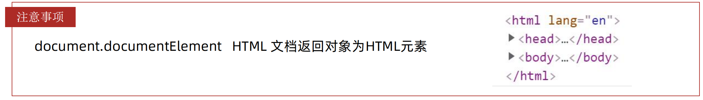
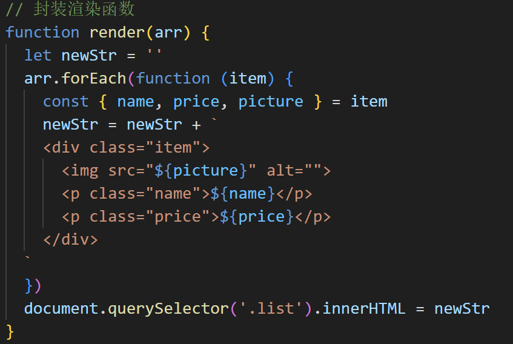

## JavaScript报错按照提示查找错误

> APIs-day6-144  10:00


## URL

URL（Uniform Resource Locator，统一资源定位符）地址是用于标识互联网上资源位置的字符串。它是互联网上标准资源的地址（Address），互联网上的每个文件都有一个唯一的URL，它包含的信息指出文件的位置以及浏览器应该怎么处理它。

URL的基本结构通常包括以下几个部分：

1. **协议（或称为方案）**：指明浏览器如何访问资源。例如，`http`表示通过超文本传输协议访问，`https`是其安全版本，`ftp`表示通过文件传输协议访问等。

2. **主机名（或称为域名）**：表示资源的服务器在Internet上的域名地址或IP地址。例如，`www.example.com`。

3. **端口号**：（可选）用于指定访问资源时所使用的端口。如果不指定，浏览器会使用默认端口。例如，HTTP的默认端口是80，HTTPS的默认端口是443。

4. **路径**：指定服务器上资源的具体位置。它可以是目录或文件的路径，由“/”分隔。例如，`/images/logo.png`。

5. **查询字符串**：（可选）提供额外的参数信息，用于过滤或定制资源。这些参数通常以`?`开头，后跟一个或多个参数，参数之间用`&`分隔。例如，`?id=123&name=example`。

6. **片段标识符**：（可选）用于直接定位到资源的某个部分，例如网页中的某个段落。它通常以`#`开头，后跟一个标识符。例如，`#section1`。

一个完整的URL示例可能是：`https://www.example.com:8080/path/to/resource?id=123&name=example#section1`。

URL地址在Web浏览器、搜索引擎、链接等场合中广泛使用，是互联网资源访问的基础。


## className属性

要获取一个元素的类名，可以访问该元素的 `className` 属性。

要设置一个元素的类名，可以直接给该元素的 `className` 属性赋值。注意，这将替换掉该元素的所有现有类名。


```html
<!DOCTYPE html>
<html lang="en">

<head>
  <meta charset="UTF-8">
  <meta name="viewport" content="width=device-width, initial-scale=1.0">
  <title>Document</title>
  <style>
    .box {
      width: 200px;
      height: 200px;
      background-color: pink;
    }

    .color {
      background-color: blue;
    }
  </style>
</head>

<body>
  <div class="box"></div>
  <script>
    document.querySelector('div').className = 'color'      //直接将 box 替换为 color
    console.log(document.querySelector('div').className)   //打印 color
  </script>
</body>

</html>
```


## 关于回调函数

如果将函数 A 做为参数传递给函数 B 时，我们称函数 A 为回调函数

简单理解： 当一个函数当做参数来传递给另外一个函数的时候，这个函数就是回调函数


```js
username.addEventListener('change', verifyName);
```

在这里，`verifyName` 是作为一个引用传递给 `addEventListener` 方法的，它告诉浏览器：“当 `change` 事件在 `username` 元素上触发时，请调用 `verifyName` 函数。”

如果写成这样：

```js
username.addEventListener('change', verifyName());
```

这会导致 `verifyName` 函数在添加事件监听器之前立即被调用，而不是作为事件触发时的回调函数。这意味着 `verifyName` 会立即执行，并且不管 `change` 事件是否发生，它的执行结果都不会与事件监听器相关联。


在JavaScript中，当执行这段代码 `if (!verifyName()) e.preventDefault()` 时，`verifyName()` 函数确实会被执行。

这里是代码执行的详细步骤：

1. **函数调用**：`verifyName()` 会被调用，并返回一个值（通常是布尔类型，但也可以是其他任何类型）。
2. **布尔取反**：返回的值会被 `!` 运算符取反。如果 `verifyName()` 返回 `true`，则 `!true` 会得到 `false`；如果 `verifyName()` 返回 `false`，则 `!false` 会得到 `true`。
3. **条件判断**：取反后的值会被用于 `if` 语句的条件判断。如果条件为 `true`（即 `verifyName()` 返回 `false` 并经过取反），则 `e.preventDefault()` 会被执行。如果条件为 `false`（即 `verifyName()` 返回 `true` 并经过取反），则 `e.preventDefault()` 不会执行。


## undefined和null的区别

### `undefined`

1. **默认值**：
   - 当一个变量被声明但没有被赋值时，它的默认值是 `undefined`。
   ```javascript
   let x;
   console.log(x); // 输出: undefined
   ```

2. **函数返回值**：
   - 如果一个函数没有返回值，或者没有执行到 `return` 语句，那么它的返回值也是 `undefined`。
   ```javascript
   function foo() {}
   console.log(foo()); // 输出: undefined
   ```

3. **属性访问**：
   - 如果尝试访问一个对象的属性，但该属性不存在，那么结果也是 `undefined`。
   ```javascript
   let obj = {};
   console.log(obj.nonExistentProperty); // 输出: undefined
   ```

### `null`

1. **显式空值**：
   - `null` 是一个显式的空值，用于表示变量应该有一个值，但当前没有值。它通常用于初始化变量，或者表示某个值被清空。
   ```javascript
   let y = null;
   console.log(y); // 输出: null
   ```

2. **语义明确**：
   - 使用 `null` 可以更加明确地表示开发者有意将变量设置为空值，而不是因为变量未初始化或未赋值导致的 `undefined`。

3. **对象属性**：
   - `null` 常用于清空对象属性，表示该属性已被删除或不应该有值。
   ```javascript
   let obj = { name: "Alice" };
   obj.name = null;
   console.log(obj.name); // 输出: null
   ```

### 区别总结

- **默认值与显式值**：
  - `undefined` 是变量未赋值或未初始化时的默认值。
  - `null` 是显式地将变量设置为空值。

- **使用场景**：
  - `undefined` 更多地用于表示未定义的情况，如变量未声明、函数未返回值、对象属性不存在等。
  - `null` 则用于表示一个变量应该有值但目前没有值，或者用于清空对象的属性。

- **类型转换**：
  - 在类型转换中，`undefined` 会转换为 `NaN`（例如，`Number(undefined)` 结果是 `NaN`），而 `null` 会转换为 `0`（例如，`Number(null)` 结果是 `0`）。


## remove() 和 removechild() 有什么区别

### `removeChild()`

- **功能**：`removeChild()` 是一个父元素的方法，用于从该父元素的子节点列表中移除一个指定的子节点。
- **参数**：它接受一个节点作为参数，这个节点必须是父元素的一个子节点。
- **返回值**：返回被移除的节点。
- **使用场景**：当你需要明确地从某个父元素中移除一个特定的子元素时，使用 `removeChild()`。

### `remove()`

- **功能**：`remove()` 是一个元素自身的方法，用于将该元素从它的父节点的子节点列表中移除。
- **参数**：它不接受任何参数。
- **返回值**：`void`，即不返回任何值。
- **使用场景**：当你想要移除一个元素，而不需要关心它的父元素是谁时，使用 `remove()`。
- **兼容性**：`remove()` 方法是在较新的DOM标准中引入的，因此在一些旧版浏览器中可能不受支持（例如，IE11不支持）。


## append() 和 appendchild() 有什么区别

### `appendChild()`

- **功能**：`appendChild()` 方法将一个节点添加到指定父节点的子节点列表的末尾。
- **参数**：它接受一个单一的节点作为参数。
- **返回值**：返回被添加的节点。
- **兼容性**：这个方法在早期的DOM规范中就存在，因此在所有现代浏览器和旧版浏览器中都有良好的支持。

### `append()`

- **功能**：`append()` 方法可以将一个或多个节点或字符串对象添加到节点的子节点列表的末尾。
- **参数**：它接受多个参数，每个参数可以是节点、字符串（会被转换为文本节点），或者是一个包含这些值的数组/类数组对象（如 `NodeList`）。
- **返回值**：`void`，即不返回任何值。
- **兼容性**：这个方法是在较新的DOM标准（DOM Level 4）中引入的，因此在一些旧版浏览器中可能不受支持（例如，IE11不支持）。


## 关于事件

> 事件：简单理解就是一个动作，比如点击一个按钮就是发生了一个点击事件
>
> 事件监听：就是让程序检测是否有事件发生，一旦有事件发生就立刻调用一个函数作出响应，也称为注册事件或者绑定事件
>
> 事件流：事件捕获阶段 => 事件目标阶段 => 事件冒泡阶段  整个完整的过程就是事件流

1. **捕获阶段：**
   - 事件从文档的根节点（通常是 `document` 对象）向目标元素传播，但不触发目标元素上的监听冒泡阶段的事件处理程序。
   - 如果为某个元素注册了监听捕获阶段的事件处理程序，那么在传播过程中会触发这些处理程序。
2. **目标阶段：**
   - 事件到达目标元素，并触发目标元素上的事件处理程序。
   - 这个阶段可以看作是捕获阶段和冒泡阶段的中间点，监听冒泡阶段的事件处理程序和监听捕获阶段的事件处理程序在这个阶段都会被触发，但它本身是一个独立的阶段。
3. **冒泡阶段：**
   - 事件从目标元素向文档的根节点传播，并触发沿途所有元素上注册的监听冒泡阶段的事件处理程序。

所有事件发生时都会经历以上三个阶段


## 元素尺寸与位置

| 属性                         | 作用                                                   | 说明                                                   |
| :--------------------------- | :----------------------------------------------------- | :----------------------------------------------------- |
| clientWidth 和  clientHeight | 获取元素的可见部分宽高                                 | 若盒子隐藏结果为0，不包含border、margin、滚动条， 只读 |
| offsetWidth 和 offsetHeight  | 获取元素的可见部分宽高                                 | 若盒子隐藏结果为0，不包含margin、滚动条， 只读         |
| offsetLeft 和 offsetTop      | 获取元素距离自己最近的 带有定位的父级元素 的左、上距离 | 只读，如果没有这样的父级元素则参照<html>               |
| scrollLeft 和   scrollTop    | 获取元素内容往左、往上滚出去看不到的距离               | 可读写 document.documentElement.scrollTop              |

**检测页面滚动的头部距离（被卷去的头部）用那个属性？**

+ document.documentElement.scrollTop




## for in 遍历对象

+ **遍历对象：**k 是获得对象的属性名， 对象名[k] 是获得 对应的属性值
+ **遍历数组：**k 是获得数组的索引号， 数组名[k] 是获得 对应的数组元素
+ 不管是遍历数组还是遍历对象，**k都是字符串型**

 
 

### 查对象的第二种方式

 


## Array

+ **map**

  map() 可以处理数据，并且返回新的数组

   


+ **join**

  join() 方法用于把数组中的所有元素转换一个字符串

   

  ​

+ **filter**

  filter() 方法创建一个新的数组，新数组中的元素是通过检查指定数组中符合条件的所有元素

  主要使用场景： 筛选数组符合条件的元素，并返回筛选之后元素的新数组

   

   

  ​

+ **forEach**

  forEach() 方法用于调用数组的每个元素，并将元素传递给回调函数

   

   


+ **reduce**

  reduce() 返回函数累计处理的结果，经常用于求和等

  

  **累计值参数：**

  1. 如果有起始值，则以起始值为准开始累计， 累计值 = 起始值
  2. 如果没有起始值， 则累计值以数组的第一个数组元素作为起始值开始累计
  3. 后面每次遍历就会用后面的数组元素 累计到 累计值 里面 （类似求和里面的 sum ）

   


+ **find**

   find()方法返回数组中 满足提供的测试函数的第一个元素的值。否则返回 undefined

    

    


+ **every**

  every() 方法测试一个数组内的所有元素是否都能通过指定函数的测试。它返回一个布尔值 true / false

   


+ **some**

  some() 方法测试数组中是否 至少有一个元素 通过了由提供的函数实现的测试。如果在数组中找到一个元素使得提供的函数返回 true，则返回 true；否则返回 false。它不会修改数组

   

  ​

+ **Array.from()**

  将伪数组转化为真数组

   

  ​


## Object

+ **keys**

  Object.keys 静态方法获取对象中所有属性（键）

   

  ​

+ **values**

  Object.values 静态方法获取对象中所有属性值

   

  ​

+ **assign** 

  Object. assign 静态方法常用于对象拷贝，经常使用的场景给对象添加属性

   

  ​

   


## String

+ **replace**
+ **split**


## Number

+ **toFixed**


Array Object已经完成

抽时间补全其他的

Node.js 下不了包、nrm  P27 - P30


## 正则表达式

+ **test()** 

  用来查看正则表达式与指定的字符串是否匹配

  ​

+ **exec()** 

  在一个指定字符串中执行一个搜索匹配


## classList

`DOMTokenList` 集合是一个在Web API中用于表示元素上类名（class names）和其他类似属性的只读属性集合。这个集合是一个动态更新的集合，它随着元素类名的变化而自动更新。`DOMTokenList` 提供了一系列的方法和属性，使得我们可以方便地操作元素的类名。

- **add()**：向集合中添加一个或多个类名。如果类名已经存在，则不会重复添加。
- **remove()**：从集合中移除一个或多个类名。
- **contains()**：检查集合中是否包含指定的类名。返回一个布尔值。
- **toggle()**：切换指定的类名。如果类名存在，则移除它；如果类名不存在，则添加它。

 


## 常见元素上 change 事件的行为

**`<input>`元素：**

- 文本输入框（`type="text"`、`type="password"`、`type="email"`等）：当用户在输入框中输入文本后，移动焦点到另一个元素时触发。
- 单选框（`type="radio"`）：当选中一个单选按钮时，如果导致关联表单控件的值发生变化，则触发。
- 复选框（`type="checkbox"`）：当选中或取消选中复选框时触发。
- 文件选择框（`type="file"`）：当选择文件时触发。

**`<select>` 元素：**

- 当下拉菜单的选项被改变时触发。

**`<textarea>` 元素：**

- 当用户在文本区域内输入文本后，移动焦点到另一个元素时触发。


## 文本输入框提交数据前的判断

`trim()` 方法用于去除字符串两端的空白字符。这里的“空白字符”通常包括空格（`' '`）、制表符（`\t`）、换行符（`\n`）等

空格字符（' '）本身是一个非空字符串，非空字符串会被视为 true

如果输入的结果只包含空格，使用 `trim()` 后结果为 空字符串

空格字符 != 空字符串

+ **使用 !this.name 判断**

  > v-model 需要 .trim()

```html
<!-- 添加资产 -->
<form class="my-form">
    <input v-model.trim="name" type="text" class="form-control" placeholder="消费名称" />
    <input v-model.number="price" type="text" class="form-control" placeholder="消费价格" />
    <button @click="add" type="button" class="btn btn-primary">添加账单</button>
</form>
```

```js
async add(){
    // 空格字符（' '）本身是一个非空字符串，非空字符串会被视为 true
    // 如果输入的结果只包含空格，使用trim()后结果为 空字符串
    // 空格字符 != 空字符串
    if(!this.name)
    {
        alert('请输入消费名称')
        return
    }
    // typeof 转换的结果为 字符串型 数据
    if(typeof this.price !== 'number')
    {
        alert('强输入正确的价格')
        return
    }
    const res = await axios.post('https://applet-base-api-t.itheima.net/bill', {
        creator: '熊二',
        name: this.name,
        price: this.price
    })
    // 重新获取数据，重新渲染
    this.getList()
    // 清空表单
    this.name = ''
    this.price = ''
}
```

+ **使用 this.todoName.trim() === '' 判断**

  > v-model 不需要 .trim()

```html
<!-- 输入框 -->
  <header class="header">
    <h1>小黑记事本</h1>
    <input @keyup.enter="handleAdd" v-model="todoName" placeholder="请输入任务" class="new-todo" />
    <button @click="handleAdd" class="add">添加任务</button>
  </header>
```

```js
handleAdd(){
      if(this.todoName.trim() === '')
      {
        alert('请输入正确的名称')
        return
      }
      // this 指向 Vue实例 
      this.$emit('add', this.todoName)
      this.todoName = ''
    }
```


## + - * /参与运算时隐形转换的原则

1. **当遇到-、\*、/运算符时**：
   - 运算符前后的值会被转换成数字（Number）类型再进行运算。
2. **当遇到+运算符时**：
   - 如果运算符两边的值都是数字（Number），则进行正常的数值相加。
   - 如果运算符两边至少有一个值是字符串（String）类型，则判定为字符串拼接，将两个值转换为字符串（String）后进行拼接。


## 同步代码和异步代码

**同步代码：**逐行执行，需原地等待结果后，才继续向下执行

**异步代码：**调用后耗时，不阻塞代码继续执行（不必原地等待），在将来完成后触发一个回调函数


## 宏任务与微任务

**宏任务：**浏览器执行的异步代码

**微任务：**JS 引擎执行的异步代码


### JavaScript代码执行顺序

1. 从上往下将同步代码放入**调用栈**执行，遇到异步代码（宏任务/微任务）交给**宿主环境（浏览器）**，异步代码有结果则其回调函数进入**对应队列**
2. 当调用栈空闲时，清空微任务队列内所有微任务，然后执行宏任务队列内第一个宏任务的回调函数
3. 之后再检查微任务队列内是否有待执行的代码，如果有则清空微任务队列，如果没有继续执行下一个宏任务的回调函数
4. 依次循环


