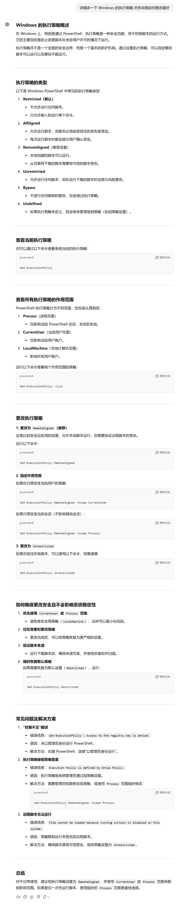

## npm下包失败解决方案

+ **以管理员身份运行 Windows PowerShell**

  > 此处注意 Windows PowerShell 和 cmd 并不相同，一些命令在 PowerShell 可以运行但是在 cmd 中却不能运行，也有一些命令恰好相反。    原则上，PowerShell 的功能要强于 cmd，cmd 是 PowerShell 的一个子集

+ **修改Windows执行策略**

  原来的策略类型 Restricted 受限

  ```powershell
  PS C:\Windows\system32> Get-ExecutionPolicy
  Restricted
  PS C:\Windows\system32> Set-ExecutionPolicy RemoteSigned

  执行策略更改
  执行策略可帮助你防止执行不信任的脚本。更改执行策略可能会产生安全风险，如 https:/go.microsoft.com/fwlink/?LinkID=135170
  中的 about_Execution_Policies 帮助主题所述。是否要更改执行策略?
  [Y] 是(Y)  [A] 全是(A)  [N] 否(N)  [L] 全否(L)  [S] 暂停(S)  [?] 帮助 (默认值为“N”): Y
  ```

  > 详细见 附图1

+ **更改最新的淘宝镜像源**

  原来的 https//:registry.npm.taobao.org/ 不能用了，最新的为：https://registry.npmmirror.com/

+ **检查 nrm 是否下载成功**

  nrm -V  V 要大写

  ```powershell
  PS C:\Users\yue> nrm -V
  2.0.0

  PS C:\Users\yue> nrm -v
  error: unknown option '-v'
  ```

  ​

 

 

 


**附图1：**

 


## 学习过程中跳过的部分

发布包 04 - 08

自定义中间件 09

跨域12 - 15

SQL 语句 06 - 10

session中间件的使用 04

在express中生成token 06

黑马李师傅个人信息案例

ECharts 数据可视化 Vue-039 小黑记事本饼图渲染

Bootstrap

Vue3 - 161 husky 要用 git


## 遇到的各种各样的问题

代码总是运行不出来

下包显示 淘宝镜像源证书过期

对象的展开运算符，图书新增案例