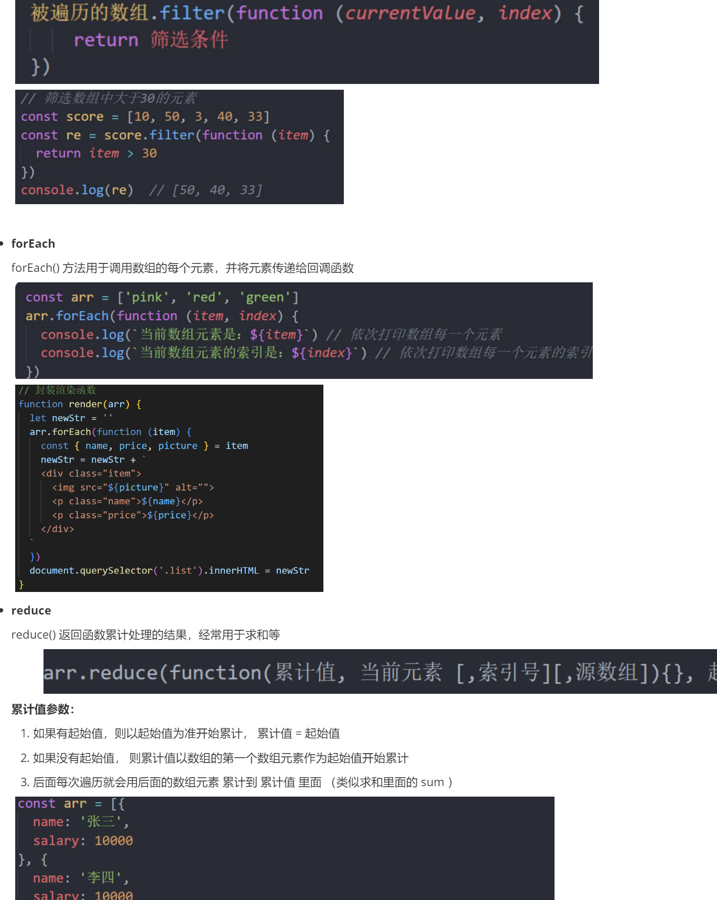

# 前端学习笔记合集 ✍️

记录我在前端学习过程中的笔记与易错点总结，涵盖 HTML、CSS、JavaScript、Vue、Ajax、Webpack 等内容，持续更新中。

### 部分内容展示：

📌 仓库结构：

-  **HTML & CSS 易错点整理 ✨**

  本笔记整理了我在学习 HTML 与 CSS 过程中遇到的一些易错点与常见坑，适合复习和面试前查漏补缺。

  📌 内容包括：

  - 常见标签语义误用
  - 块级元素 vs 行内元素区别
  - 清除浮动的几种方式
  - Flex 和 Grid 常见混淆
  - 垂直居中常用写法

- **JavaScript 易错点与知识总结 📚**

  记录 JavaScript 学习过程中的常见易错点、易混淆知识点及常考手写题。

  📌 内容包括：

  - this 指向总结
  - 闭包原理与用途
  - 原型链与继承
  - 数组/对象常用 API
  - 手写函数题（防抖/节流/深拷贝等）
  - 异步：Promise、async/await、事件循环

- **Node.js / Ajax / NPM / Git 知识笔记 ⚙️**

  整理我在学习 Node、Ajax、包管理器 NPM 和 Git 过程中记录的常用命令与理解点。

  📦 Node.js

  - 创建本地服务器（http 模块）
  - 处理请求与响应
  - 使用 express 快速搭建服务

  🔗 Ajax & 接口通信

  - 原生 XHR 请求流程
  - fetch 使用示例
  - 请求状态码与处理逻辑

  📦 npm 使用

  - 安装本地包 vs 全局包
  - package.json 配置
  - 常见脚本设置

  🧑‍ Git & 命令行

  - 本地提交与远程 push
  - 分支操作与合并
  - 基础命令速查表

- **命令行与快捷键备忘录 ⌨️**

  记录开发过程中常用的终端命令、VS Code 快捷键等效率工具的使用方式。

  📌 内容包括：

  - VS Code 快捷键（格式化/多光标/查找替换）
  - Git 命令速查（init/clone/push）
  - Node 相关命令（node server.js / npm run dev）
  - 常见 CLI 工具用法（Vue CLI / Webpack CLI）

- **C语言学习笔记 🧠**

  记录我在学习 C语言过程中的语法点、常见错误和二级计算机考试重点内容。

  📌 内容包括：

  - 变量与数据类型
  - if/while/for 控制结构
  - 数组与指针基础
  - 函数定义与调用
  - 文件读写基础

🚀 持续更新，欢迎交流 !
