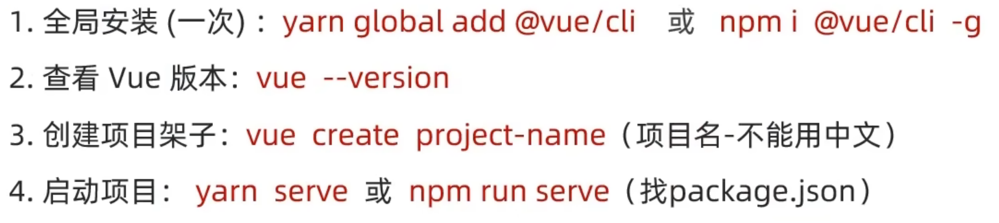
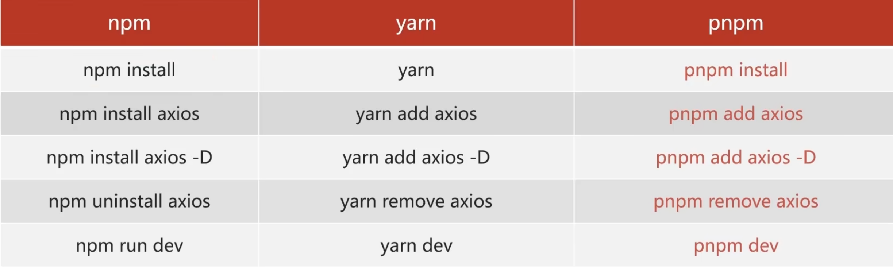
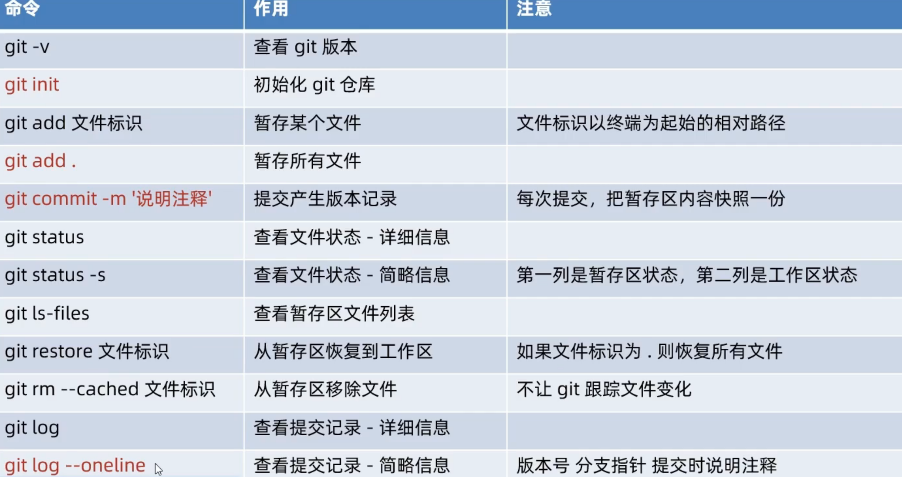
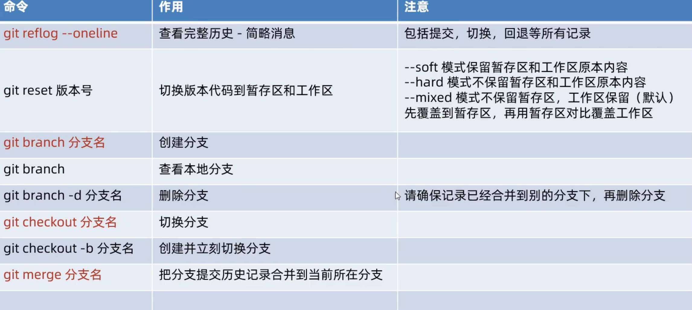
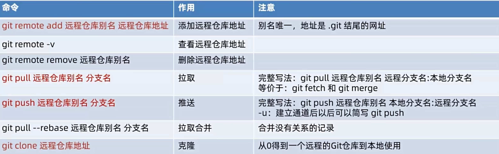
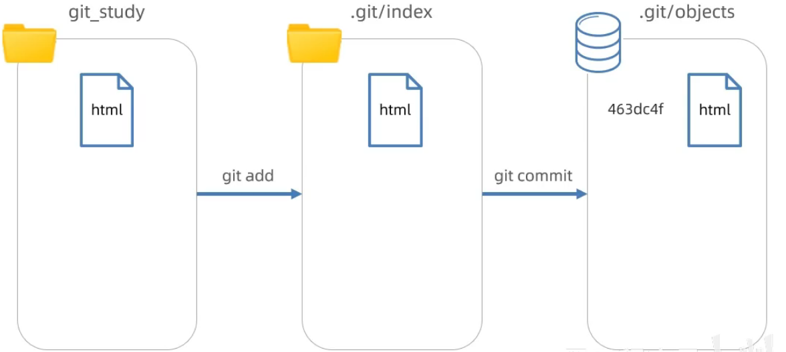
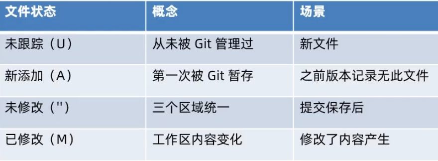
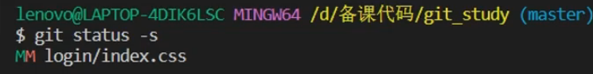

## 基本卸载方法

1. **打开终端或命令提示符**：
   确保你已经打开了终端

2. **导航到项目根目录**：
   使用`cd`命令导航到你的Node.js项目的根目录。例如：

   ```powershell
   cd path/to/your/project
   ```

3. **运行卸载命令**：
   使用`npm uninstall`命令后跟要卸载的包名来卸载依赖包。例如，要卸载名为`example-package`的包，可以运行：

   ```powershell
   npm uninstall example-package
   ```

   这将会从`node_modules`目录中删除该包，并从`package.json`文件的`dependencies`或`devDependencies`部分中移除对应的条目（取决于该包是作为生产依赖还是开发依赖安装的）。


## 重新下载所有依赖包

删除 `node_modules` 文件夹后，可以使用 `npm install` 命令来重新下载并安装项目所需的依赖包

1. **检查 package.json 文件**：
   确保你的项目根目录下有一个 `package.json` 文件。这个文件包含了项目所需的所有依赖包及其版本号。

2. **运行 npm install**：
   打开命令行工具（如 CMD、PowerShell），导航到项目根目录，然后运行以下命令：

   ```powershell
   npm install
   ```
   或者
   ```powershell
   npm i
   ```

   这个命令会读取 `package.json` 文件中的 `dependencies` 和 `devDependencies` 部分，并下载、安装所有列出的依赖包及其指定版本。


## VueCLI 脚手架

**操作步骤：**

 

**注意：**

+ 用管理员身份运行 PowerShell 执行第一步
+ 前两步每台电脑只需要执行一次
+ 第三步要在想要 创建项目的文件夹 的路径下执行，执行完代码后会在该文件夹下创建一个项目


 


## 用 yarn 和 npm 下载包

`yarn add vue-router@3.6.5` 这条命令用于使用 Yarn 包管理器安装特定版本的 `vue-router`（版本 3.6.5，想要使用 npm（Node 包管理器）来实现相同的功能，可以使用以下命令：

```powershell
npm install vue-router@3.6.5
```

```powershell
yarn add vue-router@3.6.5
```

这条命令会执行与 `yarn add vue-router@3.6.5` 相同的操作，即安装指定版本的 `vue-router`。


在使用 Yarn 或 npm 添加依赖包时，默认情况下，包会被添加到项目的 `dependencies` 中，而不是 `devDependencies`。这意味着该依赖包在生产环境中也是必需的，即当你的项目被部署到服务器并运行时，这个依赖包应该被包含在内。

具体来说，当你运行 `yarn add axios` 命令时，`axios` 包会被添加到 `dependencies` 中。这是因为 `yarn add`（以及 npm 的 `npm install <package>`）命令默认安装的是项目运行所需的依赖。

如果你想要将某个包添加到 `devDependencies` 中，即这个包只在开发过程中需要（例如测试框架、构建工具等），你可以使用 `--dev` 或 `-D` 标志。例如：

```
yarn add axios --dev
# 或者
yarn add axios -D
```

这样，`axios` 包就会被添加到 `devDependencies` 中，而不是 `dependencies`。

同样地，在 npm 中，你可以使用以下命令将包添加到 `devDependencies`：

```
npm install axios --save-dev
# 或者简写为
npm install axios -D
```

总之，`yarn add axios` 会将 `axios` 添加到 `dependencies` 中，而 `yarn add axios --dev` 或 `yarn add axios -D` 会将其添加到 `devDependencies` 中。


## `--save-dev` 的作用

当使用 npm 安装一个包时，可以通过 `--save-dev` 参数来指定这个包应该被添加到项目的 `devDependencies` 中，而不是 `dependencies` 中。这个参数主要用于区分项目开发和运行时所需的依赖。

- **dependencies**：这些依赖是项目在生产环境中运行所必需的。也就是说，当你的项目被部署到生产服务器并运行时，这些依赖需要被安装和可用。
- **devDependencies**：这些依赖仅在开发过程中需要。它们可能包括构建工具、测试框架、代码编辑器插件等。在生产环境中，这些依赖通常不是必需的，因此不需要被安装。

如果不添加`--save-dev`默认将包应该被添加到项目的`dependencies` 中


学习 npm 的 其他用法

配置 yarn 环境


## Git

### git常用命令








### git操作流程

 

**基本操作流程：**

1. git init 初始化仓库生成 .git 文件夹，.git 文件夹存在的 文件夹A 为生成的 本地git仓库，以这个 文件夹A 为根目录就可以执行 git命令

2. 在 VSCode 中修改文件后，文件状态会发生变化 git status -s 可以查看文件状态

    

    

3. 文件修改完成后可以使用 git add . 将工作区修改的文件保存到暂存区

   > 暂存区与工作区存在多种交互关系
   >
   > 1. 查看暂存区文件列表   git ls-files
   > 2. 将文件从暂存区恢复到工作区   git restore page/login/index.html
   > 3. 从暂存区移除文件   git rm --cached page/login/index.html

4. 保留到暂存区的文件可以通过 git commit -m '文件标识' 将文件提交到 git版本库

   > 查看提交记录 - 简略信息   git log --oneline
   >
   > 查看完整历史 - 简略信息   git reflog --oneline

5. 文件提交到 git版本库 中后可以切换版本代码到暂存区和工作区

   > 例如 git reset --hard a219582
   >
   > 注意：代码按照 git版本库 => 暂存区 => 工作区 的顺序依次 覆盖/保留，若进行版本代码切换的时候，git版本库与暂存区代码相同则该流程不会继续往下进行，所以这种情况工作区的代码不会被 覆盖/保留

**使用 git 分支 和 远程仓库 实现多人协同**

+ **git 分支**可以在一份主干代码上形成多个分支代码，使得页面的多个功能可以分别同时开发而不影响主干代码，待功能开发完成之后再将分支代码合并到主干代码
+ **远程仓库**可以实现将不同版本的代码进行多人共享，小组成员在获得足够权限的前提下，可以拉取共享仓库中的代码，也可以将自己修改的代码推送到共享仓库中实现多人协同开发


